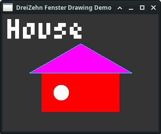
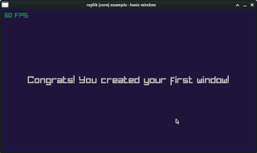

# DreiZehn-Script

A lightweight, modular scripting language built from scratch in C++. 

It was designed for embedding a Script language into your Application. 

[Handbook](handbook/Main.md)

[Todo / Done List](Todo.md)

[Benchmark Results](Benchmark.md)


### Why is it called DreiZehn Script ? 
Dreizehn is the number 13 in german. I also work on ElfScript (Elf == 11 in german) and so i count up. 
I did not want to use the Umlaut "ö" in Zwölf (==12) so i stepped up to 13 which is DreiZehn.
Dreizehn is also a prime number, happy number, Fibonacci number, a lucky number and much more.


## Basic SDL3 implementation 

Version 0.3: I added SDL3 to test my Script system:

Only some commands are ported.  

```
SDL_Init SDL_INIT_VIDEO

Window = SDL_CreateWindow "Hello 13" 320 200 SDL_WINDOW_RESIZABLE
Renderer = SDL_CreateRenderer Window "opengl"
Event = SDL_CreateEvent

Running = true
while Running
    while SDL_PollEvent Event
        Type = SDL_GetEventType Event
        if Type == SDL_EVENT_QUIT
            Running = false
        end

        if Type == SDL_EVENT_KEY_DOWN
            Key = SDL_GetEventKey Event
            if Key == SDLK_ESCAPE
                Running = false
            end
        end
    end

    SDL_SetRenderDrawColor Renderer 30 30 40 255
    SDL_RenderClear Renderer

    SDL_SetRenderDrawColor Renderer 255 255 255 255
    SDL_RenderDebugText Renderer 10 10 "Hello SDL3 with events"

    SDL_RenderPresent Renderer
    SDL_Delay 16
end

SDL_DestroyWindow Window
SDL_Quit
```

## Fenster implementation

DreiZehn 0.5c - I added Fenster lib as Object :)

Fenster and FensterAudio bindings are completed.



```
W = 320
H = 240
fenster = Fenster:new "DreiZehn Fenster Drawing Demo" W H

fenster->rect 0 0 W H 0x00333333
fenster->rect (W / 4) (H / 2) (W / 2) (H / 3) 0x00ff0000
fenster->rect (W / 2) (H / 2 + H / 12) (W / 6) (H / 3 - H / 12) 0x00ff0000
fenster->circle (W / 2 - W / 8) (H / 2 + H / 6) (W / 20) 0x00ffffff
fenster->line (W / 4 - 25) (H / 2) ( W / 2 ) ( H / 4 ) 0x0000ffff
fenster->line (W - W / 4 + 25) (H / 2) (W / 2) (H / 4) 0x0000ffff
fenster->line (W - W / 4 + 25) (H / 2) (W / 4 - 25) (H / 2) 0x0000ffff
fenster->fill (W / 2) (H / 3) 0x00333333 0x00ff00ff
fenster->text 10 10 "House" 8 0x00ffffff

while fenster->loop
    -- ESC
   if fenster->isKeyDown 27
       print "BREAK!"
       break
   end
end

fenster->close
fenster = 0
```

## Raylib implementation

DreiZehn 0.6b - Initial Raylib bindings 

I also started an auto generator from .json file but it's not finished so far. 
So it's really only the commands you see in the example below.



```
screenWidth    = 800
screenHeight   = 450

rl::InitWindow screenWidth screenHeight "raylib [core] example - basic window"
rl::SetTargetFPS 60

text       = "Congrats! You created your first window!"
fontSize   = 30
textWidth  = rl::MeasureText text fontSize
x = screenWidth  / 2 - textWidth / 2
y = screenHeight / 2 - fontSize  / 2
bgColor = rl::Color 30 20 60 255

while !rl::WindowShouldClose && core::breath

    rl::BeginDrawing

    rl::ClearBackground bgColor
    rl::DrawFPS 10 10
    rl::DrawText text x y fontSize rl::LIGHTGRAY

    rl::EndDrawing
end

rl::CloseWindow


```
